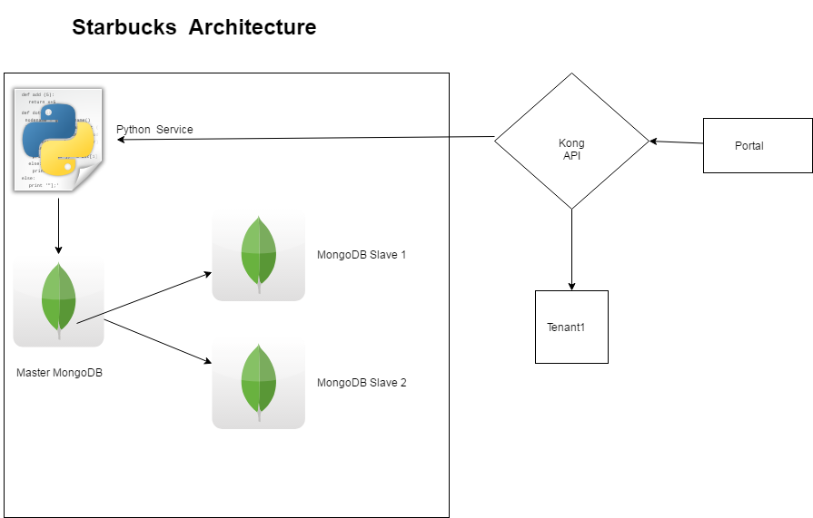

# Tenant 2 of Starbucks
A. Portal -
  1. Portal can be accessed at https://cloud-ninjas.herokuapp.com/

  2. Portal code available at https://github.com/pshrutiii/aws-gateway

  3. Portal written in PHP and JS.

B. Tenant 2 
  1. REST services are written in Python

  2. Three way MongoDB replication with a master being synced to two slaves hosted in AWS for storing tenant data

  3. Instructions on how to install MongoDB cluster on AWS - https://mongodb-documentation.readthedocs.io/en/latest/ecosystem/tutorial/install-mongodb-on-amazon-ec2.html
  
  4. All code run through [CodeClimate](https://codeclimate.com/github/gladiatorAsh/Starbucks) for Code Quality upkeep
  
  5. 
  
  6. Video of [Project Demo](https://youtube.com)
  
  
